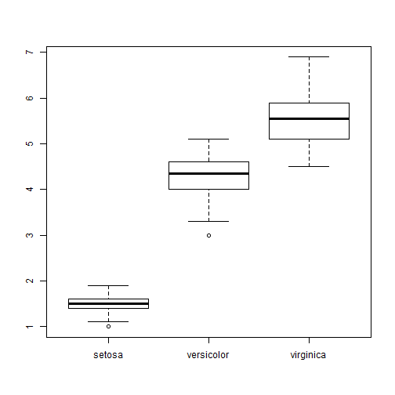
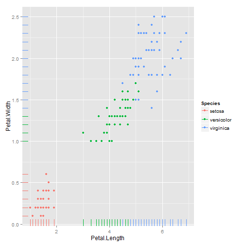
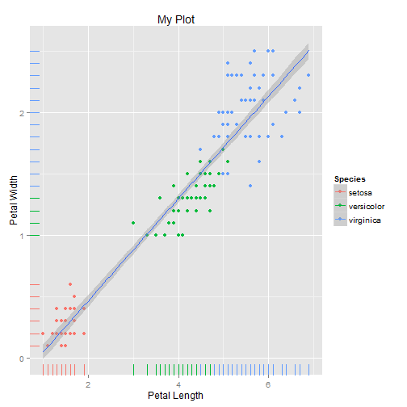

% Visualization

# Data visualization in R

- R contains many packages for data visualization
- This means that you can usually create the visualization you need, but you may have to sort through packages sometimes
- Fortunately, there are a few basic and powerful graphics packages
- We'll look at `graphics` (included in R) and `ggplot2`

# The graphics package: scatterplots

- R contains a number of easy, built-in functions for graphics
- The simplest is the scatterplot

```r
x <- seq(from = -10, to = 10, length.out = 100)
y <- x^2
plot(x, y)
```

 


# Drawing a curve


```r
plot(x, y, type = "l")
```

 


# Adding labels


```r
plot(x, y, type = "l", col = "blue", ylab = "x^2")
```

 


# Adding back the points


```r
plot(x, y, type = "l", col = "blue", ylab = "x^2")
points(x, y, col = "red")
```

 


# Some real data


```r
head(iris)
```

```
##   Sepal.Length Sepal.Width Petal.Length Petal.Width Species
## 1          5.1         3.5          1.4         0.2  setosa
## 2          4.9         3.0          1.4         0.2  setosa
## 3          4.7         3.2          1.3         0.2  setosa
## 4          4.6         3.1          1.5         0.2  setosa
## 5          5.0         3.6          1.4         0.2  setosa
## 6          5.4         3.9          1.7         0.4  setosa
```


# The graphics package: boxplots


```r
boxplot(Petal.Length ~ Species, iris)
```

 


# The graphics package: bar graphs


```r
barplot(1:3, col = c("red3", "darkgreen", "navyblue"))
```

 


# ggplot2

- The `ggplot2` library provides an object-oriented, data-centered approach to graphics
- It also produces better-looking graphics by default!
- On the other hand, it takes a bit more work to understand

# Scatterplot


```r
library(ggplot2)
qplot(Petal.Length, Petal.Width, data = iris)
```

 


# Adding more dimensions using color


```r
qplot(Petal.Length, Petal.Width, color = Species, data = iris)
```

 


# Adding more dimensions using faceting


```r
qplot(Petal.Length, Petal.Width, data = iris) + facet_wrap(~Species)
```

 


# Adding another "geom"


```r
qplot(Petal.Length, Petal.Width, color = Species, data = iris) + geom_rug()
```

 


# Adding labels


```r
qplot(Petal.Length, Petal.Width, color = Species, data = iris) + geom_rug() + 
    xlab("Petal Length") + ylab("Petal Width") + ggtitle("My Plot")
```

 


# Computing statistics: linear regression


```r
qplot(Petal.Length, Petal.Width, color = Species, data = iris) + geom_rug() + 
    stat_smooth(method = lm) + xlab("Petal Length") + ylab("Petal Width") + 
    ggtitle("My Plot")
```

 


# Computing statistics: linear regression


```r
qplot(Petal.Length, Petal.Width, color = Species, data = iris) + geom_rug() + 
    stat_smooth(aes(group = 0), method = lm) + xlab("Petal Length") + ylab("Petal Width") + 
    ggtitle("My Plot")
```

 


# Computing statistics: 2D kernel density


```r
qplot(Petal.Length, Petal.Width, color = Species, data = iris) + geom_rug() + 
    geom_density2d() + xlab("Petal Length") + ylab("Petal Width") + ggtitle("My Plot")
```

 


# Another syntax


```r
ggplot(iris, aes(Petal.Length, Petal.Width, color = Species)) + geom_point()
```

 


# Box plots


```r
qplot(Species, Petal.Length, data = iris, geom = "boxplot")
```

 


# Histograms


```r
ggplot(iris, aes(Petal.Length)) + geom_histogram(binwidth = 0.2) + facet_wrap(~Species, 
    ncol = 1)
```

 

